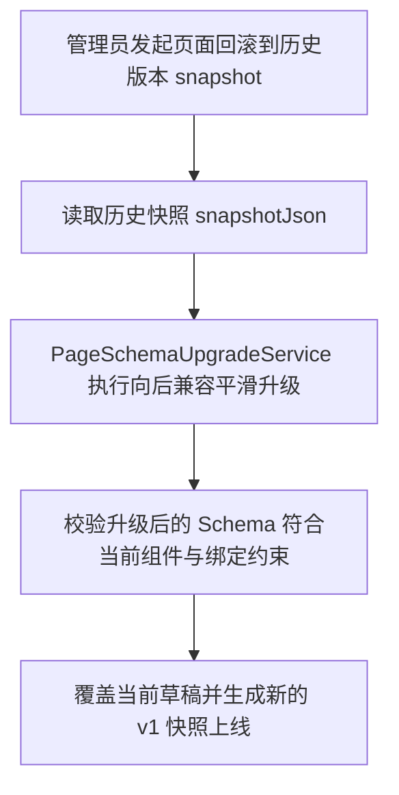

# P1-1 Schema 版本与兼容策略实施方案 (plan.md)

本文档详细定义低代码官网后端 **P1-1 Schema 版本与兼容策略** 的核心对象、技术拆解、预计难点与解决办法、边界条件及代码改造规范。

---

## 一、核心对象与版本模型 (Core Version Models)

1. **Schema 模型升级 (`PageSchemaModel`)**：
   * 在 `PageSchemaModel` 顶层增加 `schemaVersion`（`Integer` 类型，当前最新标准版本为 `1`）。
   * 若历史存量快照/草稿中 `schemaVersion` 为 `null` 或未定义，服务端自动将其判定为 Legacy `v0` 版本，并在加载或读取时安全升级。
2. **Schema 升级服务 (`PageSchemaUpgradeService`)**：
   * 负责服务端只读平滑升级逻辑（如从 `v0` 补齐默认 `schemaVersion = 1` 节点、补齐缺省结构等）。
   * 限制升级链路为递增链（如 `v0` $\rightarrow$ `v1`），严禁允许客户端反向降级或直接修改版本号绕过升级器。
3. **版本校验器 (`PageSchemaValidationService`)**：
   * 校验入参 `schemaVersion` 是否在当前后端可接受的版本范围（目前仅允许 `<= CURRENT_VERSION` 即 `1`）。
   * 对于未来的未知高版本（如客户端传入 `schemaVersion = 99`），统一拒绝保存并抛出业务异常 `10012` (`PAGE_SCHEMA_VERSION_UNSUPPORTED`)。

---

## 二、技术拆解 (Technical Breakdown)

### 1. Schema 校验与升级流程

```mermaid
graph TD
    A[管理员提交保存草稿 / 受控预览 / 发布页面] --> B[反序列化 PageSchemaModel]
    B --> C{schemaVersion 是否为空?}
    C -- 是 --> D[归类为 Legacy v0]
    C -- 否 --> E{schemaVersion > CURRENT_VERSION(1)?}
    E -- 是 --> F[拒绝操作 抛 10012 不支持的 Schema 版本]
    E -- 否 --> G[进入 PageSchemaUpgradeService.upgradeToCurrent]
    D --> G
    G --> H[输出标准 v1 结构的 PageSchemaModel]
    H --> I[继续进行 Schema 白名单清洗与落库]
```

### 2. 存量快照与回滚链路兼容



---

## 三、预计难点与解决办法

### 难点 1：历史存量数据库中缺少 `schemaVersion` 字段的数据兼容
* **场景与风险**：系统在线数据库中现存的页面草稿 (`cms_page_draft`) 和发布快照 (`cms_page_publish_snapshot`) 中的 JSON 可能未包含 `schemaVersion` 键。如果直接校验 `schemaVersion != null` 强制要求，将导致历史已有草稿读取或页面回滚时直接报 400 失败。
* **解决办法**：在 Jackson 反序列化或 `PageSchemaUpgradeService` 中做容错。若 `schemaVersion == null`，则自动标识为 `0`（Legacy 初始版本），并透明升级为 `1`。

### 难点 2：客户端非法篡改版本号高向低降级或跳跃升级
* **场景与风险**：恶意客户端尝试提交低于当前标准的历史 schemaVersion 或构造非法的大版本号。
* **解决办法**：后端在 `PageSchemaValidationService` 中严格闭环校验。提交的 `schemaVersion` 只能等于 `CURRENT_VERSION(1)`。如果前端提交了低于当前版本的 Schema，后端强制通过统一升级器升级后再保存；对于高于后端当前理解的版本，一律阻断。

---

## 四、边界条件分析 (Boundary Conditions)

1. **`schemaVersion > 1` (未来未知版本)**：
   * 抛出 `BusinessException(ErrorCode.PAGE_SCHEMA_VERSION_UNSUPPORTED)`，HTTP 状态码 400，返回“不支持的 Schema 版本，请刷新或升级编辑器”。
2. **`schemaVersion < 0` 或非数字类型**：
   * 校验器在 JSON 解析/Bean Validation 层直接拦截。
3. **已发布历史版本回滚**：
   * 回滚任意旧版本快照时，服务端先加载快照，通过升级器提升为最新 `schemaVersion = 1` 后再写入新版本。
