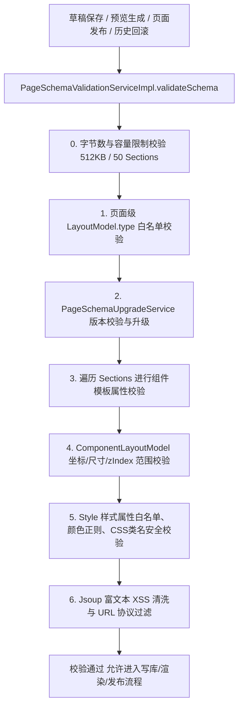

# P1-2 布局与样式白名单实施方案 (plan.md)

本文档详细定义低代码官网后端 **P1-2 布局与样式白名单** 的核心对象、校验规则、技术拆解、预计难点与解决办法、边界条件及代码改造规范。

---

## 一、治理目标与规则模型 (Rules & Specification)

### 1. 结构划分三要素 (`layout` / `style` / `props`)
为支持前端自由拖拽、绝对定位、栅格与流式摆放，每个 Section/组件配置统一拆分为三个独立维度：
* **`layout` (组件布局配置)**：控制绝对坐标 (`x`, `y`)、尺寸 (`width`, `height`)、定位方式 (`position`) 与叠放层级 (`zIndex`)。
* **`style` (外观样式配置)**：控制字号 (`fontSize`)、字重 (`fontWeight`)、文本对齐 (`textAlign`)、颜色 (`color`/`backgroundColor`)、边距 (`padding`/`margin`)、透明度 (`opacity`) 等。
* **`props` (组件业务属性)**：控制文本内容、图片 ID、链接等业务数据。

### 2. 页面与组件布局模式白名单 (`layout.type` & `position`)
* **页面级布局模式白名单 (`LayoutModel.type`)**：仅允许 `flow` (标准流), `grid` (栅格), `absolute` (绝对定位坐标画布), `default` (默认混合流)。不在白名单中的模式直接拒绝保存。
* **组件级定位方式白名单 (`position`)**：仅允许 `static`, `relative`, `absolute`, `fixed`, `sticky`。

### 3. 数值、范围与格式校验规范
| 属性类别 | 目标属性 | 允许类型 / 格式正则 | 合法范围约束 | 异常处理 |
| :--- | :--- | :--- | :--- | :--- |
| **坐标尺寸** | `x`, `y` | Integer / Double / CSS 长度 | `[-10000, 10000]` 或合法 px/vw/vh/% | 抛 10001 参数错误 |
| **坐标尺寸** | `width`, `height` | Integer / Double / CSS 长度 | `[0, 10000]` 或 `auto`/`fit-content`等 | 抛 10001 参数错误 |
| **层级控制** | `zIndex` | Integer | `[-100, 9999]` (防无限高层级 DoS) | 抛 10001 参数错误 |
| **透明度** | `opacity` | Double / Float | `[0.0, 1.0]` | 抛 10001 参数错误 |
| **色彩格式** | `color`, `backgroundColor` 等 | Hex (`#FFF`, `#FFFFFF`, `#FFFFFFFF`), RGB/RGBA, HSL/HSLA, safe keywords | 正则 `^#([0-9a-fA-F]{3,4}\|[0-9a-fA-F]{6}\|[0-9a-fA-F]{8})$` 或 `rgb/rgba/hsl/hsla/transparent/inherit` | 抛 10001 参数错误 |
| **标识符白名单**| `className`, `fontFamily`, `animationName` | 安全字符串 | 正则 `^[a-zA-Z0-9_\-\s]+$` (严禁 `;`, `{`, `}`) | 抛 10001 参数错误 |

### 4. Schema 物理容量与配额上限 (Quotas & Limits)
1. **Schema 序列化字节数**：最大 `512 KB` (524,288 Bytes)，超过直接拒绝。
2. **单页 Section 区块上限**：最多 `50` 个。
3. **单个属性文本长度**：长文本最多 `10,000` 字符；标题/短文本按组件模板 Schema 限制。
4. **安全 URL 协议过滤**：仅允许 `http://`, `https://`, `mailto:`, `/` 开头；严格过滤 `javascript:`, `data:` (非 Safe Image) 等恶意外链。

---

## 二、核心对象与数据模型 (Core Domain Objects)

1. **组件布局模型 (`ComponentLayoutModel`)**：
   * 在 `SectionModel` 中新增 `layout` 属性（或通过 Map 装载并提供强类型 Bean 校验）。包含 `position`, `x`, `y`, `width`, `height`, `zIndex` 等。
2. **布局样式校验器 (`LayoutStyleValidationHelper`)**：
   * 提供对 `layout` 和 `style` Map 的集中式白名单清洗与范围比对。
3. **全链路复用校验**：
   * 在 `PageSchemaValidationServiceImpl` 的 `validateSchema` 中挂载白名单校验。由于保存草稿、受控预览生成、发布上线、版本回滚均统一调用 `validateSchema`，实现全链路防逃逸。

---

## 三、技术拆解 (Technical Breakdown)

---

## 四、预计难点与解决办法

### 难点 1：自由拖拽绝对定位与 CSS 灵活性的安全边界控制
* **场景与风险**：前端允许用户自定义摆放位置，可能传入浮点数坐标、百分比或复合 CSS 样式。过宽的校验可能导致 CSS 注入（如传入 `color: "red; background: url('http://evil.com')"`），过窄的校验会导致拖拽参数无法保存。
* **解决办法**：
  * 对常用坐标尺寸提取为强类型/正则模式，限制只能是纯数字或以 `px|em|rem|%|vw|vh` 结尾的合理字符串。
  * `style` 属性键只允许已注册的样式白名单集合（如 `fontSize`, `fontWeight`, `textAlign`, `color`, `backgroundColor`, `padding`, `margin`, `borderRadius`, `boxShadow`, `opacity`）。不在白名单里的非预期样式属性直接抛出 10001 异常阻断。

### 难点 2：避免全量 Schema 校验重复代码导致逃逸
* **场景与风险**：若仅在保存草稿处添加校验，发布或回滚未校验，历史不良快照仍可能破坏线上渲染。
* **解决办法**：
  * 所有写路径（Save Draft）、预览生成（Create Preview）、发布上线（Publish Page）、版本回滚（Rollback Page）统一收口调用 `PageSchemaValidationService.validateSchema`，实现一处校验、全线受益。

---

## 五、边界条件分析 (Boundary Conditions)

1. **`zIndex` 超界 (如 `zIndex = 9999999`)**：
   * 触发 `zIndex` 范围比对，抛出 `10001` 参数错误“组件 zIndex 超出允许范围 [-100, 9999]”。
2. **恶意 CSS 注入 (如 `color = "black} body { display:none }"` 或 `javascript:` 链接)**：
   * 颜色正则匹配失败或 URL 校验拦截，抛出 `10001` 参数错误。
3. **超大 JSON 攻击 (如提交 2MB 的巨大字符串)**：
   * 在校验首行检测序列化字节数，超过 512KB 立即抛出 `10001` 参数错误“页面配置体积超出 512KB 上限”。
