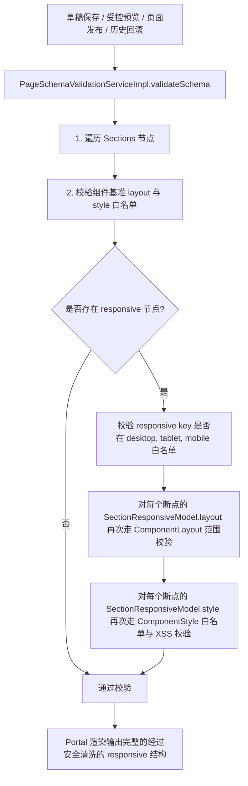

# P1-3 响应式断点协议实施方案 (plan.md)

本文档详细定义低代码官网后端 **P1-3 响应式断点协议** 的核心对象、视口断点规范、属性继承与覆盖规则、技术拆解、预计难点与解决办法、边界条件及代码改造规范。

---

## 一、核心概念与视口断点规范 (Viewport Breakpoint Specification)

为解决拖拽排版仅在特定分辨率生效的问题，系统引入三级响应式断点控制，允许每个组件区块在不同视口下重写其 `layout` (位置/尺寸/层级) 与 `style` (字号/内边距/颜色/对齐等) 属性。

### 1. 首期视口断点定义与优先级

| 断点标识 (`breakpointKey`) | 视口范围 (Viewport Range) | 含义描述 | 匹配优先级 | 继承默认源 |
| :--- | :--- | :--- | :--- | :--- |
| **`desktop`** | $\ge 1200\text{px}$ | 桌面大屏（基准默认视图） | P0 (基础视图) | 无 (底层基准配置) |
| **`tablet`** | $768\text{px} \sim 1199\text{px}$ | 平板视口 | P1 | 继承回退 `desktop` |
| **`mobile`** | $< 768\text{px}$ | 移动端手机视口 | P2 | 优先继承 `tablet`，次继承 `desktop` |

### 2. 覆盖与继承规则 (Override & Fallback Logic)
1. **基准定义**：组件顶层的 `layout` 与 `style` 作为 `desktop` 的默认配置。
2. **渐进重写 (Partial Override)**：`responsive` Map 节点仅需定义该视口下发生的差异属性（例如平板下改字号 `fontSize: "18px"`，移动端下从 `position: absolute` 切为 `position: relative`）。
3. **回退算法**：当客户端或渲染引擎要求计算特定断点的完整最终样式时，遵从：`Computed(mobile) = default(desktop) <- overlay(tablet) <- overlay(mobile)` 级联叠加。
4. **组件树禁分叉**：禁止在不同断点动态增删 `Section` 节点。树结构（`sections` 数组及其 `id`）全视口保持一致，仅允许组件属性级在同一组件内受控重写。

---

## 二、核心对象与 Schema 协议 (Core Domain Objects)

### 1. 组件响应式配置模型 (`SectionResponsiveModel`)
在 `SectionModel` 中新增 `private Map<String, SectionResponsiveModel> responsive;` 节点：
* Key 仅支持：`desktop`, `tablet`, `mobile`。
* Value 包含：
  * `layout` (`ComponentLayoutModel`)：当前断点覆盖的 `x`, `y`, `width`, `height`, `zIndex`, `position`。
  * `style` (`Map<String, Object>`)：当前断点覆盖的样式属性键值。

```json
{
  "id": "section_hero",
  "component": "HeroBanner",
  "layout": {
    "position": "absolute",
    "x": 120,
    "y": 48,
    "width": 360,
    "height": 72,
    "zIndex": 2
  },
  "style": {
    "fontSize": 24,
    "color": "#111111"
  },
  "responsive": {
    "mobile": {
      "layout": {
        "position": "relative",
        "x": 0,
        "y": 0,
        "width": "100%",
        "height": "auto"
      },
      "style": {
        "fontSize": 16
      }
    }
  }
}
```

---

## 三、技术拆解 (Technical Breakdown)



---

## 四、预计难点与解决办法

### 难点 1：组件响应式断点递归白名单校验遗漏
* **场景与风险**：前端可能在 `responsive.mobile` 节点注入非法 `zIndex = 999999` 或恶意 JavaScript CSS。若仅校验了基础 `layout`/`style`，而跳过了 `responsive` 内部，攻击载荷会绕过防御进入生产数据库。
* **解决办法**：在 `LayoutStyleValidationHelper` 中增加 `validateResponsiveMap` 方法。递归对 `responsive` 中声明的每一个断点（`tablet`, `mobile`）的 `layout` 与 `style` 再次执行与基础配置完全相同的 `validateComponentLayout` 和 `validateComponentStyle` 严格白名单过滤。

### 难点 2：断点与基础配置的脏数据清洗与脱敏输出
* **场景与风险**：前端编辑时可能产生空的 `responsive` 节点或非法的 `breakpointKey`（如 `pc_screen`）。
* **解决办法**：非白名单的 `breakpointKey` 一律抛出 `10001` 参数错误；Portal 渲染模型透传清洗后的 `responsive` 模型，前端视口解析时语义完全一致。

---

## 五、边界条件分析 (Boundary Conditions)

1. **非法的 `breakpointKey` (如 `responsive: { "iphone": {...} }`)**：
   * 校验器匹配失败，抛出 `10001` 参数错误“不支持的响应式断点标识: iphone，合法标识为 [desktop, tablet, mobile]”。
2. **断点覆盖中 `zIndex` 超界 (如 `mobile.layout.zIndex = 99999`)**：
   * 触发断点 `ComponentLayout` 校验，抛出 `10001` 参数错误。
3. **断点覆盖中 `style` 包含危险脚本**：
   * 触发断点 `ComponentStyle` 校验，抛出 `10001` 参数错误。
