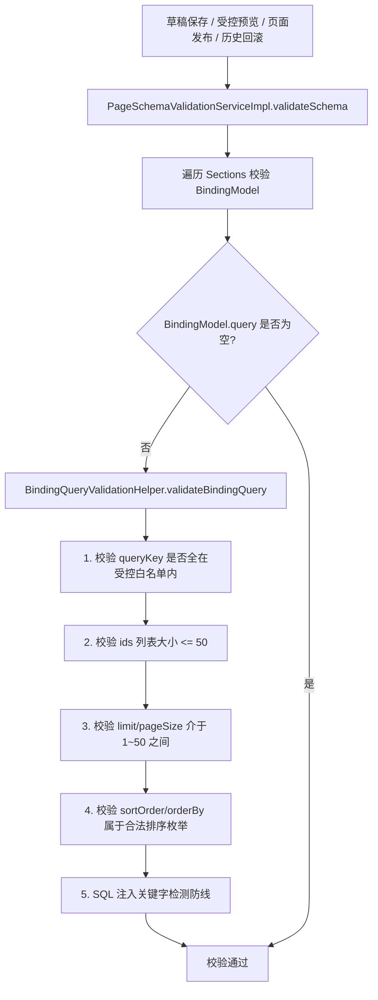

# P1-4 组件模板与绑定参数扩展实施方案 (plan.md)

本文档详细定义低代码官网后端 **P1-4 组件模板与绑定参数扩展** 的首期组件集、元数据驱动 Schema 协议、数据绑定筛选入参白名单校验、技术拆解、预计难点与解决办法、边界条件及代码改造规范。

---

## 一、治理目标与首期组件集 (Core Goals & Initial Component Catalog)

### 1. 首期 10 大核心物料组件集
系统收录并标准化以下 10 大首期物料组件集，每个组件元数据具备清晰的 `propsSchema`, `styleSchema`, `layoutSchema` 及默认值 `defaultPropsJson`：

| 组件编码 (`componentCode`) | 组件名称 | 组件分类 | 关键属性 (`propsSchema`) | 支持的数据绑定源 (`bindingCapability`) |
| :--- | :--- | :--- | :--- | :--- |
| **`Container`** | 容器/分栏 | 布局容器 | `columns`, `gap`, `direction` | 不支持 |
| **`Heading`** | 标题 | 基础文本 | `text`, `level` (h1-h6), `link` | `site_config` |
| **`Text`** | 正文段落 | 基础文本 | `text`, `maxLines` | `site_config` |
| **`Image`** | 图片 | 基础媒体 | `mediaId`, `alt`, `link` | `site_config` |
| **`Button`** | 按钮 | 交互控制 | `label`, `link`, `variant` | 不支持 |
| **`RichText`** | 富文本区块 | 富文本内容 | `content` (Jsoup 清洗) | `site_config` |
| **`Carousel`** | 轮播 Banner | 动态展示 | `autoplay`, `interval`, `items` | `home_metric_card` |
| **`ProductList`** | 产品列表 | 业务展示 | `title`, `displayStyle` | `product` (受控动态绑定) |
| **`CaseList`** | 标杆案例列表 | 业务展示 | `title`, `displayStyle` | `case` (受控动态绑定) |
| **`InquiryForm`** | 客户留资表单 | 互动表单 | `formTitle`, `submitButtonText` | `contact_info`, `cooperation_direction_tag` |

### 2. 绑定参数 (`BindingModel.query`) 严格白名单与校验

为了防止前端在请求数据绑定时注入非法 SQL、字段名或超大查询，组件绑定模型中的 `query` 参数严格限制为以下 5 种受控查询参数，严禁任意 SQL 语句或拼装表/字段名：

| 查询参数 (`queryKey`) | 数据类型 | 允许范围 / 合法枚举 | 异常处理 |
| :--- | :--- | :--- | :--- |
| **`categoryId`** | Long / Positive Integer | 正整数 ID (单个分类) | 抛 10001 参数错误 |
| **`ids`** | List\<Long\> / Long[] | 正整数列表，单次最多 `50` 个 ID | 抛 10001 参数错误 |
| **`limit` / `pageSize`**| Integer | `1 ~ 50` 范围内整数（默认 10） | 抛 10001 参数错误 |
| **`sortOrder` / `orderBy`**| String | 仅允许 `SORT_ASC`, `SORT_DESC`, `CREATE_TIME_DESC`, `LATEST` | 抛 10001 参数错误 |

---

## 二、核心对象与数据模型 (Core Domain Objects)

1. **绑定参数校验器 (`BindingQueryValidationHelper`)**：
   * 负责对 `BindingModel.query` 进行参数 Key 的白名单校验，限制只能包含 `categoryId`, `ids`, `limit`, `pageSize`, `sortOrder`, `orderBy`。
   * 强校验 `ids` 大小上限为 50，`limit`/`pageSize` 上限为 50，`sortOrder`/`orderBy` 枚举合法性。
2. **模板 Schema 扩展 (`ComponentTemplateVO`)**：
   * 在 `ComponentTemplateVO` 中提供 `getPropsSchema()`, `getStyleSchema()`, `getLayoutSchema()` 的平滑转换，方便前端渲染属性面板与画布拖拽控制。

---

## 三、技术拆解 (Technical Breakdown)

---

## 四、预计难点与解决办法

### 难点 1：防止前端通过 `BindingModel.query` 提交恶意查询 SQL 或非法排序表达式
* **场景与风险**：前端可能会在 `query` 中传入 `orderBy: "id; DROP TABLE users;"` 或 `customWhere: "status=1 OR 1=1"`，绕过数据访问安全门禁。
* **解决办法**：
  * 强制将 `query` 的 key 限制在 `categoryId`, `ids`, `limit`, `pageSize`, `sortOrder`, `orderBy` 白名单内，任何其他未声明 key 均触发 10001 参数错误。
  * `sortOrder`/`orderBy` 仅允许白名单枚举值（`SORT_ASC`, `SORT_DESC`, `CREATE_TIME_DESC`, `LATEST`），完全切断动态 SQL 拼接通道。

### 难点 2：批量绑定查询的资源 DoS 保护
* **场景与风险**：前端在 `query.ids` 中传入成千上万个 ID 或 `limit = 100000`，可能导致数据库和内存爆炸。
* **解决办法**：在 `BindingQueryValidationHelper` 中把 `ids` 大小限制为最多 50 个，把 `limit`/`pageSize` 限制在 1~50 范围内。

---

## 五、边界条件分析 (Boundary Conditions)

1. **`query` 包含非白名单 key (如 `query: { "customSQL": "select * from user" }`)**：
   * 触发 key 白名单校验，抛出 `10001` 参数错误“组件 Binding query 包含非允许的参数: customSQL”。
2. **`ids` 列表超过 50 个**：
   * 触发数量上限校验，抛出 `10001` 参数错误“组件 Binding query.ids 单次最多查询 50 个 ID”。
3. **`limit` 超过 50 条 (如 `limit = 100`)**：
   * 触发数量上限校验，抛出 `10001` 参数错误“组件 Binding query.limit 最大不能超过 50”。
4. **非法排序枚举 (如 `orderBy: "unknown_sort"`)**：
   * 触发枚举校验，抛出 `10001` 参数错误“组件 Binding query 排序方式不合法”。
