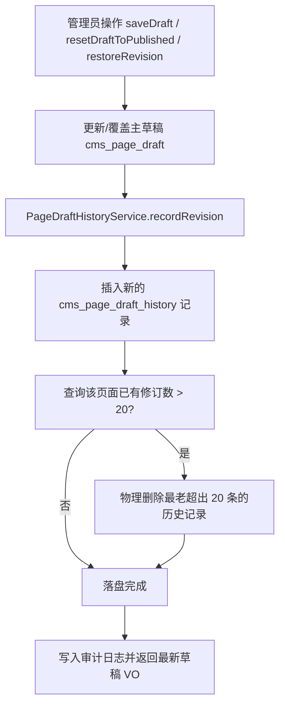

# P2-1 草稿自动保存与修订历史实施方案 (plan.md)

本文档详细定义低代码官网后端 **P2-1 草稿自动保存与修订历史** 的核心对象、自动保存节流与冲突处理机制、服务端草稿修订历史数据模型、Admin API 契约、历史保留与清理策略、技术拆解、预计难点与解决办法、边界条件及代码改造规范。

---

## 一、治理目标与机制设计 (Goals & Mechanism Design)

### 1. 自动保存、节流与并发冲突处理
* **节流策略与前端契约**：前端编辑器按节流间隔（推荐 30 秒或用户停止操作 3 秒）向后端发送 `PUT /admin/api/page-builder/drafts/{pageId}` 保存草稿请求。
* **门禁控制**：必须携带 `X-Editor-Lock-Token` 编辑锁凭证与当前草稿的乐观锁 `version` 版本号。
* **冲突处理 (Anti-Silent Overwrite)**：若检测到并发版本冲突，服务端抛出 `HTTP 409` + `10003 (COMMON_STATE_CONFLICT)` 异常，并在响应体的 `data` 中带回数据库最新的草稿 VO 数据（含最新 Schema 与 `version`），前端展示提示对话框由用户选择载入最新版或强覆盖，绝不静默覆盖数据。

### 2. 草稿修订历史保留策略 (Retention Strategy)
* **最大保留条数**：单个页面默认最多保留 `20` 条最新的草稿修订记录。
* **自动清理机制 (Automatic Pruning)**：每次成功创建新修订记录时，后端自动检测该页面的历史总条数；若超过 20 条，按 `revision_no` 正序自动擦除最老的历史记录，保证数据体积有界可控。
* **数据隔离**：草稿修订记录属 `Admin` 后台专有，Portal 前台与受控预览绝不直接访问历史修订表。

---

## 二、核心对象与数据模型 (Core Domain Objects & Database Schemas)

### 1. 数据库表结构设计 (`cms_page_draft_history`)
新建数据库表 `cms_page_draft_history` 用于持久化草稿历史快照：

```sql
CREATE TABLE IF NOT EXISTS `cms_page_draft_history` (
  `id` BIGINT NOT NULL AUTO_INCREMENT COMMENT '修订记录ID',
  `page_id` BIGINT NOT NULL COMMENT '关联页面ID',
  `draft_id` BIGINT NOT NULL COMMENT '关联主草稿ID',
  `revision_no` INT NOT NULL COMMENT '修订版本序号 (1, 2, 3...)',
  `schema_json` LONGTEXT NOT NULL COMMENT '当前修订的完整 Schema 配置 (JSON)',
  `schema_hash` VARCHAR(64) NOT NULL COMMENT '当前配置 SHA-256 哈希',
  `editor_session_remark` VARCHAR(255) DEFAULT NULL COMMENT '编辑会话备注/恢复说明',
  `created_by` VARCHAR(64) NOT NULL COMMENT '修订创建人',
  `created_at` DATETIME NOT NULL DEFAULT CURRENT_TIMESTAMP COMMENT '创建时间',
  PRIMARY KEY (`id`),
  KEY `idx_page_revision` (`page_id`, `revision_no`)
) ENGINE=InnoDB DEFAULT CHARSET=utf8mb4 COMMENT='页面草稿历史修订快照表';
```

### 2. 核心 Domain 类定义
1. **`PageDraftHistoryEntity`**：对应 `cms_page_draft_history` 数据实体。
2. **`PageDraftHistoryVO`**：修订历史展示视图对象，包含 `id`, `pageId`, `revisionNo`, `schemaHash`, `editorSessionRemark`, `createdBy`, `createdAt`；详情接口包含完整 `schemaJson`。
3. **`PageDraftHistoryService`**：提供草稿修订的异步/同步记录、超额清理、分页查询、单条详情查看及恢复指定修订的核心方法。

---

## 三、Admin 接口契约设计 (Admin API Contracts)

1. **分页查询草稿修订历史列表**：
   * `GET /admin/api/page-builder/drafts/{pageId}/revisions?pageNo=1&pageSize=10`
   * 返回 `PageResult<PageDraftHistoryVO>`（摘要列表默认排除 `schemaJson` 大文本）。
2. **获取指定草稿修订详情**：
   * `GET /admin/api/page-builder/drafts/{pageId}/revisions/{revisionId}`
   * 返回 `PageDraftHistoryVO`（包含完整 `schemaJson` 供查看比对）。
3. **恢复指定草稿修订**：
   * `POST /admin/api/page-builder/drafts/{pageId}/revisions/{revisionId}/restore`
   * Header：`X-Editor-Lock-Token`（编辑锁凭证）
   * Query / Body：`version`（当前草稿并发乐观锁版本号）
   * 功能：将指定的历史修订 Schema 覆盖写入当前主草稿，主草稿乐观锁 `version` + 1，同时触发记录一条新的修订记录，并写入审计日志 `RESTORE_DRAFT_REVISION`。

---

## 四、技术拆解 (Technical Breakdown)



---

## 五、预计难点与解决办法

### 难点 1：恢复指定草稿历史时的并发写安全与乐观锁约束
* **场景与风险**：管理员 A 在恢复历史修订 #5 的同时，管理员 B 提交了在线保存，导致修订覆盖产生冲突。
* **解决办法**：恢复草稿修订接口强制要求校验编辑锁 Header `X-Editor-Lock-Token` 且显式传入当前草稿乐观锁 `version`。在事务内执行 `ConcurrencyHelper.tryUpdate`；若版本不一致直接抛出 `409` 冲突并返回最新草稿数据。

### 难点 2：修订历史无限膨胀对 MySQL 存储与性能的影响
* **场景与风险**：自动保存频繁触发（如每 30 秒一次），若不做有界控制，`schema_json` 大文本字段会导致数据库空间迅速膨胀。
* **解决办法**：
  * 在数据库增加 `(page_id, revision_no)` 索引。
  * 每次 `recordRevision` 执行完插入后，隐式执行 `DELETE FROM cms_page_draft_history WHERE page_id = ? AND id NOT IN (SELECT id FROM ... ORDER BY revision_no DESC LIMIT 20)`，硬性保证单个页面历史有界（最高 20 条）。

---

## 六、边界条件分析 (Boundary Conditions)

1. **查询不存在的 `revisionId` 或页面 `pageId` 不匹配**：
   * 抛出 `10002 (COMMON_RESOURCE_NOT_FOUND)` 异常，提示“指定的草稿修订记录不存在”。
2. **尝试恢复软删除或未启用页面的草稿修订**：
   * 触发 `requireActivePage(pageId)` 门禁，拦截并抛出 `PAGE_NOT_FOUND` 异常。
3. **编辑锁已过期或凭证不匹配时尝试恢复**：
   * 触发 `EditorLockService` 校验，返回 `409` / `403` 并提示重新获取编辑锁。
