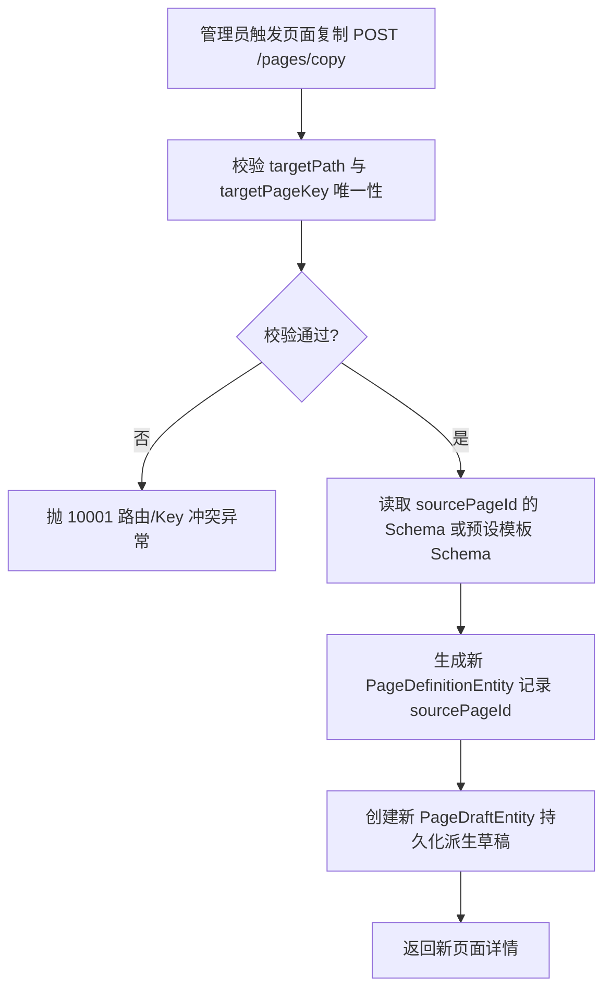

# P2-3 复用区块与模板建页实施方案 (plan.md)

本文档详细定义低代码官网后端 **P2-3 复用区块与模板建页** 的设计目标、共享区块语义、页面复制与模板建页流程、防路由冲突门禁、Admin API 契约、技术拆解、预计难点与解决办法、边界条件及代码改造规范。

---

## 一、方案选型与治理规约 (Design Selection & Governance)

### 1. 页面复制与模板建页机制
管理员常基于已有成功页面或预设标准模板快速派生创建新页面（如建活动落地页或产品二级页）。

* **唯一字段强制重置**：复制操作必须显式指定全新的 `targetName`、`targetPath` (URL 路由路径) 与 `targetPageKey` (页面标识 Key)，后端严格进行唯一性冲突校验，切断路径/Key 重复风险。
* **来源链路追溯 (Source Traceability)**：在页面定义中增加 `source_page_id` (来源页面 ID) 与 `source_template_code` (来源模板编码) 字段，方便审计与追踪派生树。

### 2. 共享复用区块语义 (Shared Block Semantics)
* **引用模型 (`refBlockId`)**：组件 `SectionModel` 中允许指定 `refBlockId`（引用的全局共享区块 ID），实现 Header、Footer、通用 CTA 的统一维护。
* **影响诊断**：提供共享区块影响诊断 API，当欲下线或修改共享区块时，扫描并返回引用该区块的所有活跃页面与草稿列表，防止误删破坏线上渲染。

---

## 二、核心对象与数据模型 (Core Domain Objects & DTOs)

### 1. 页面复制请求对象 (`PageCopyDTO`)
```java
public class PageCopyDTO {
    private Long sourcePageId;          // 来源页面 ID (与 sourceTemplateCode 二选一)
    private String sourceTemplateCode;  // 来源页面模板编码
    private String targetName;          // 目标页面名称 (必填)
    private String targetPath;          // 目标 URL 路由路径 (必填, 强制唯一)
    private String targetPageKey;       // 目标页面标识 Key (必填, 强制唯一)
}
```

### 2. 页面定义实体模型扩充 (`PageDefinitionEntity`)
* 追加 `sourcePageId` (`BIGINT NULL COMMENT '派生来源页面ID'`)
* 追加 `sourceTemplateCode` (`VARCHAR(64) NULL COMMENT '派生来源模板编码'`)

---

## 三、Admin 接口契约设计 (Admin API Contracts)

1. **从已有页面或模板复制创建新页面**：
   * `POST /admin/api/page-builder/pages/copy`
   * 请求体：`PageCopyDTO` (包含 `sourcePageId`/`sourceTemplateCode` 及目标 `targetName`, `targetPath`, `targetPageKey`)
   * 返回：新建的页面 VO（`PageDefinitionVO` 及初始草稿）。
   * 错误码：
     * `10001`（HTTP 400）：`targetPath` 或 `targetPageKey` 格式不合法或与已有活跃页面产生冲突。
     * `10002`（HTTP 404）：来源页面或来源模板不存在。

2. **全局共享区块影响诊断**：
   * `GET /admin/api/page-builder/shared-blocks/{blockId}/impact`
   * 返回：引用该共享区块的页面列表及影响范围摘要。

---

## 四、技术拆解 (Technical Breakdown)



---

## 五、预计难点与解决办法

### 难点 1：复制页面时遗留旧组件 Section ID 造成冲突
* **场景与风险**：直接复制源页面的 `sections` 数组，如果保留了原始组件区块的 `id`（如 `sec_hero_123`），会导致多页间组件 ID 混淆或预览上下文污染。
* **解决办法**：在复制 Schema 时，调用 `PageCopyHelper` 递归重新为目标页面的每一个 Section 重新生成全新的全局唯一 `id`（如 `sec_` + UUID 缩写），保证每个页面组件节点的独立性。

### 难点 2：URL 路由 Path 与 PageKey 并发冲突
* **场景与风险**：管理员复制时传入了与在线其他页面相同的 `targetPath: "/about"`。
* **解决办法**：在 Service 层的 `validateUniquePathAndKey` 中，通过 Mapper 检索 `deleted_marker = 0` 的所有页面，强校验 `path` 与 `pageKey` 是否重复，冲突直接拦截并返回友好提示。

---

## 六、边界条件分析 (Boundary Conditions)

1. **`sourcePageId` 指向已逻辑删除的页面**：
   * 无法读取源 Schema，抛出 `PAGE_NOT_FOUND` 异常。
2. **复制时 `targetPath` 缺失前斜杠 (如 `targetPath: "product-a"`)**：
   * 校验器自动格式化归一化为 `"/product-a"`，保证路由格式合法。
